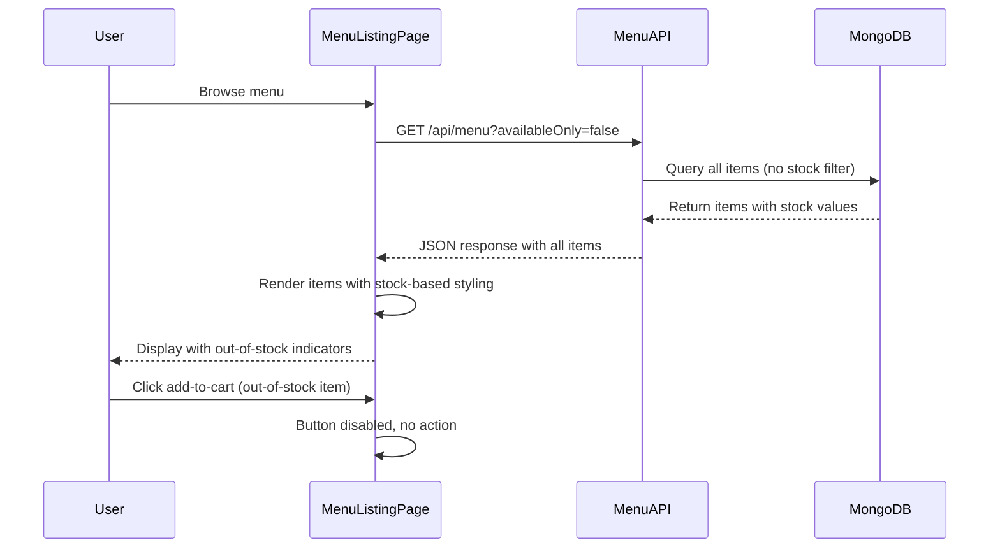

# Design Document: Out-of-Stock Item Display

## Overview

This design implements visual indicators for out-of-stock menu items within the existing menu browsing system. The solution enhances the user experience by showing unavailable items with clear visual distinction while preventing cart additions.

The implementation spans both frontend (React/TypeScript) and backend (Node.js/Express/MongoDB), modifying the existing `MenuListingPage` component and `/api/menu` endpoint. The design prioritizes minimal changes to existing logic while adding clear, accessible out-of-stock indicators.

### Key Design Decisions

1. **API-First Approach**: The backend will control out-of-stock filtering via the existing `availableOnly` query parameter, defaulting to current behavior (hiding out-of-stock items) unless explicitly requested.

2. **Visual Hierarchy**: Out-of-stock items use reduced opacity (0.6) with a prominent banner overlay rather than blur or grayscale, maintaining theme consistency and accessibility.

3. **Interaction Prevention**: Disabled state on add-to-cart buttons with cursor styling prevents user confusion and cart errors.

4. **Feature Toggle**: The frontend will initially request `availableOnly=false` to show out-of-stock items. This can be easily toggled or made configurable for A/B testing.

## Architecture

### Component Structure

```
MenuListingPage (Modified)
├── Menu API Call (Modified query parameter)
├── Menu Item Cards (Modified rendering logic)
│   ├── Out-of-Stock Banner (New)
│   ├── Card Opacity Styling (Modified)
│   └── Disabled Add Button (Modified)
└── Existing Features (Unchanged)
    ├── Category filtering
    ├── Veg-only toggle
    ├── Favorites
    └── Infinite scroll
```

### Backend Flow

```
GET /api/menu
  ├── Parse availableOnly parameter
  ├── Build MongoDB query
  │   ├── If availableOnly=true → stock > 0 & available=true
  │   └── If availableOnly=false → return all items
  ├── Apply other filters (category, veg, search)
  ├── Execute query with pagination
  └── Return items with stock values
```

### Data Flow



## Components and Interfaces

### Frontend Components

#### MenuListingPage (Modified)

**Location**: `client/src/components/menu/MenuListingPage.tsx`

**Changes**:
1. Modify API query to set `availableOnly: 'false'`
2. Add out-of-stock banner rendering logic
3. Apply opacity styling based on `item.stock === 0`
4. Disable add-to-cart button when `item.stock === 0`

**New Helper Functions**:

```typescript
const isOutOfStock = (item: MenuItem): boolean => {
  return item.stock === 0;
};

const renderOutOfStockBanner = (): JSX.Element => {
  return (
    <div className="absolute top-0 left-0 right-0 z-10 bg-red-500 text-white text-xs font-bold py-1.5 text-center">
      OUT OF STOCK
    </div>
  );
};
```

**Styling Changes**:

```typescript
// Card wrapper opacity
<div className={`relative ${isOutOfStock(item) ? 'opacity-60' : ''}`}>

// Button disabled state
<button
  disabled={isOutOfStock(item)}
  className={`${isOutOfStock(item) ? 'opacity-50 cursor-not-allowed' : ''}`}
>
```

#### OutOfStockBanner (New Component - Optional)

**Location**: `client/src/components/menu/OutOfStockBanner.tsx`

This is an optional extraction if we want better separation of concerns.

```typescript
interface OutOfStockBannerProps {
  theme: 'light' | 'dark';
}

export const OutOfStockBanner: React.FC<OutOfStockBannerProps> = ({ theme }) => {
  return (
    <div className={`absolute top-0 left-0 right-0 z-10 py-1.5 text-center ${
      theme === 'dark' 
        ? 'bg-red-600/90 text-white' 
        : 'bg-red-500 text-white'
    }`}>
      <span className="text-xs font-bold uppercase tracking-wide">
        OUT OF STOCK
      </span>
    </div>
  );
};
```

### Backend API Modifications

#### GET /api/menu (Modified)

**Location**: `server/routes.ts` (line ~1600)

**Current Behavior**:
```typescript
const showAvailableOnly = availableOnly !== 'false';
if (showAvailableOnly) {
  query.available = true;
  query.stock = { $gt: 0 };
}
```

**No Changes Needed**: The existing logic already supports showing out-of-stock items when `availableOnly=false`. We just need to use this parameter from the frontend.

**Query Parameter**:
- `availableOnly`: String value 'true' or 'false'
  - 'true' (default): Returns only items with `stock > 0` and `available = true`
  - 'false': Returns all items regardless of stock

**Response Format** (Unchanged):
```typescript
{
  items: MenuItem[],
  pagination: {
    currentPage: number,
    totalPages: number,
    totalItems: number,
    itemsPerPage: number,
    hasNextPage: boolean,
    hasPrevPage: boolean
  }
}
```

## Data Models

### MenuItem Interface (Existing - No Changes)

```typescript
interface MenuItem {
  id: string;
  _id?: string;
  name: string;
  price: number;
  description?: string;
  imageUrl?: string;
  isVegetarian: boolean;
  categoryId: string;
  categoryName?: string;
  canteenId: string;
  stock: number;          // Used to determine out-of-stock status
  available: boolean;     // General availability flag
  calories?: number;
  cookingTime?: number;
  storeCounterId?: string;
  paymentCounterId?: string;
}
```

### Key Fields for Out-of-Stock Logic

- `stock`: Number - When this equals 0, item is out of stock
- `available`: Boolean - General availability (separate from stock)

The feature relies on `stock === 0` as the primary indicator for out-of-stock status.


## Correctness Properties

*A property is a characteristic or behavior that should hold true across all valid executions of a system—essentially, a formal statement about what the system should do. Properties serve as the bridge between human-readable specifications and machine-verifiable correctness guarantees.*

### Property 1: API Returns Out-of-Stock Items When Requested

*For any* menu API request with `availableOnly=false`, the response SHALL include menu items where `stock === 0`.

**Validates: Requirements 1.1, 5.2**

### Property 2: API Excludes Out-of-Stock Items By Default

*For any* menu API request with `availableOnly=true` or `availableOnly` omitted, the response SHALL only include menu items where `stock > 0`.

**Validates: Requirements 5.3**

### Property 3: API Response Includes Stock Field

*For any* menu API response, every returned menu item SHALL have a `stock` field with a numeric value.

**Validates: Requirements 5.4**

### Property 4: Out-of-Stock Items Displayed in Menu Grid

*For any* menu rendering containing a mix of in-stock and out-of-stock items, all items SHALL appear in the rendered menu grid.

**Validates: Requirements 1.2**

### Property 5: Out-of-Stock Items Have Consistent Card Structure

*For any* rendered menu item (whether in-stock or out-of-stock), the card SHALL contain the same structural elements (image area, title, price display, buttons, etc.).

**Validates: Requirements 1.3**

### Property 6: Out-of-Stock Banner Presence and Text

*For any* rendered out-of-stock menu item (`stock === 0`), the card SHALL contain a visible banner element with text "OUT OF STOCK" positioned at the top of the card.

**Validates: Requirements 1.4, 2.1, 2.2**

### Property 7: Out-of-Stock Visual Styling Applied

*For any* rendered out-of-stock menu item, the card SHALL have reduced opacity (between 0.5 and 0.7) OR a grayscale filter OR a blur effect applied.

**Validates: Requirements 3.1, 3.2**

### Property 8: Consistent Styling Across Out-of-Stock Items

*For any* set of rendered out-of-stock menu items, all items SHALL have identical visual styling attributes (same opacity value, same filters).

**Validates: Requirements 3.3**

### Property 9: Theme-Aware Styling Adjustments

*For any* out-of-stock menu item rendered in different theme modes (light/dark), the styling SHALL include theme-appropriate class names or style attributes.

**Validates: Requirements 3.5**

### Property 10: Add-to-Cart Button Disabled for Out-of-Stock Items

*For any* rendered out-of-stock menu item, the add-to-cart button element SHALL have the `disabled` attribute set to `true`.

**Validates: Requirements 4.2**

### Property 11: Cart Addition Prevented for Out-of-Stock Items

*For any* out-of-stock menu item, clicking the add-to-cart button SHALL NOT increase the cart quantity for that item.

**Validates: Requirements 4.1**

### Property 12: Disabled Button Visual Styling

*For any* disabled add-to-cart button on an out-of-stock item, the button SHALL have CSS styling indicating non-interactive state (reduced opacity or cursor: not-allowed).

**Validates: Requirements 4.3, 4.4**

### Property 13: Available Items Unaffected by Out-of-Stock Logic

*For any* menu item with `stock > 0`, the rendered card SHALL NOT have out-of-stock banner, SHALL NOT have reduced opacity, and the add-to-cart button SHALL NOT be disabled.

**Validates: Requirements 6.1**

### Property 14: Favorite Functionality Preserved for Out-of-Stock Items

*For any* out-of-stock menu item, clicking the favorite/heart icon SHALL toggle the favorite state for that item.

**Validates: Requirements 6.2**

### Property 15: Navigation Preserved for Out-of-Stock Items

*For any* out-of-stock menu item card, clicking on the card (outside interactive buttons) SHALL navigate to the item detail page.

**Validates: Requirements 6.3**

### Property 16: Filtering Includes Out-of-Stock Items

*For any* menu filter operation (category, veg-only, search) when `availableOnly=false`, the filtered results SHALL include out-of-stock items that match the filter criteria.

**Validates: Requirements 5.5, 6.4**

## Error Handling

### Frontend Error Scenarios

1. **Missing Stock Field**
   - If API response item lacks `stock` field, treat as available (stock > 0)
   - Log warning to console for debugging
   - Prevents breaking existing items without stock field

2. **Invalid Stock Value**
   - If `stock` is not a number or is negative, treat as out-of-stock
   - Safer to prevent ordering than to allow potentially invalid items

3. **API Request Failure**
   - Fall back to existing behavior (availableOnly=true)
   - Display cached items if available
   - Show error message to user with retry option

4. **Theme Context Unavailable**
   - Default to light mode styling
   - Out-of-stock indicators still functional

### Backend Error Scenarios

1. **Invalid availableOnly Parameter**
   - Treat any value other than 'false' as 'true'
   - Maintains backward compatibility

2. **Database Query Failure**
   - Return empty items array with error message
   - Log error for monitoring
   - Send 500 status with descriptive message

3. **Missing Stock Field in Database**
   - Items without stock field excluded from results
   - Log warning for data integrity monitoring

## Testing Strategy

### Unit Testing

**Frontend Unit Tests** (`MenuListingPage.test.tsx`):

1. **Out-of-Stock Banner Rendering**
   - Test: Render menu item with stock=0, verify banner element exists
   - Test: Verify banner text is "OUT OF STOCK"
   - Test: Render menu item with stock>0, verify banner does NOT exist

2. **Button Disabled State**
   - Test: Render out-of-stock item, verify button has disabled attribute
   - Test: Render in-stock item, verify button is NOT disabled
   - Test: Click disabled button, verify cart quantity unchanged

3. **Visual Styling Application**
   - Test: Out-of-stock item has opacity class applied
   - Test: In-stock item does not have opacity class
   - Test: Styling changes with theme toggle

4. **Existing Functionality Preservation**
   - Test: Favorite toggle works on out-of-stock items
   - Test: Card click navigation works on out-of-stock items
   - Test: Category filter includes out-of-stock items

**Backend Unit Tests** (`routes.test.ts`):

1. **availableOnly Parameter Handling**
   - Test: availableOnly=false returns items with stock=0
   - Test: availableOnly=true returns only stock>0 items
   - Test: availableOnly omitted defaults to true behavior

2. **Filter Combination**
   - Test: Category filter with availableOnly=false returns both stock states
   - Test: Veg-only filter with availableOnly=false returns both stock states
   - Test: Search filter with availableOnly=false returns both stock states

3. **Response Schema**
   - Test: All returned items have stock field
   - Test: Stock field is numeric type

### Property-Based Testing

Property-based tests will run with minimum 100 iterations using the appropriate PBT library for JavaScript/TypeScript (fast-check).

**Property Test 1: API Inclusion Round Trip**
```typescript
// Feature: out-of-stock-item-display, Property 1: API returns out-of-stock items when requested
// Generate: Random menu items with various stock values (including 0)
// Action: Call API with availableOnly=false
// Assert: Response includes items where stock === 0
```

**Property Test 2: API Exclusion Round Trip**
```typescript
// Feature: out-of-stock-item-display, Property 2: API excludes out-of-stock items by default
// Generate: Random menu items with various stock values
// Action: Call API with availableOnly=true
// Assert: All returned items have stock > 0
```

**Property Test 3: Stock Field Presence**
```typescript
// Feature: out-of-stock-item-display, Property 3: API response includes stock field
// Generate: Random API request parameters
// Action: Call API
// Assert: Every item in response has numeric stock field
```

**Property Test 4: Rendering Completeness**
```typescript
// Feature: out-of-stock-item-display, Property 4: Out-of-stock items displayed in menu grid
// Generate: Random array of items with mixed stock values
// Action: Render MenuListingPage with generated items
// Assert: Number of rendered cards equals input array length
```

**Property Test 5: Card Structure Consistency**
```typescript
// Feature: out-of-stock-item-display, Property 5: Out-of-stock items have consistent card structure
// Generate: Random menu items (both in-stock and out-of-stock)
// Action: Render each item
// Assert: All cards have same structural elements (image, title, price, buttons)
```

**Property Test 6: Banner Presence**
```typescript
// Feature: out-of-stock-item-display, Property 6: Out-of-stock banner presence and text
// Generate: Random out-of-stock menu items (stock === 0)
// Action: Render item card
// Assert: Card contains element with text "OUT OF STOCK" at top position
```

**Property Test 7: Visual Styling Application**
```typescript
// Feature: out-of-stock-item-display, Property 7: Out-of-stock visual styling applied
// Generate: Random out-of-stock menu items
// Action: Render item card
// Assert: Card has opacity between 0.5-0.7 OR grayscale/blur filter
```

**Property Test 8: Styling Consistency**
```typescript
// Feature: out-of-stock-item-display, Property 8: Consistent styling across out-of-stock items
// Generate: Random set of out-of-stock items (n > 1)
// Action: Render all items
// Assert: All items have identical styling values
```

**Property Test 9: Theme Awareness**
```typescript
// Feature: out-of-stock-item-display, Property 9: Theme-aware styling adjustments
// Generate: Random out-of-stock item
// Action: Render in light theme, then dark theme
// Assert: Different theme-specific classes applied
```

**Property Test 10: Button Disabled Attribute**
```typescript
// Feature: out-of-stock-item-display, Property 10: Add-to-cart button disabled for out-of-stock items
// Generate: Random out-of-stock menu items
// Action: Render item card
// Assert: Add-to-cart button has disabled=true
```

**Property Test 11: Cart Addition Prevention**
```typescript
// Feature: out-of-stock-item-display, Property 11: Cart addition prevented for out-of-stock items
// Generate: Random out-of-stock menu item
// Action: Simulate add-to-cart button click
// Assert: Cart quantity for item remains 0
```

**Property Test 12: Disabled Button Styling**
```typescript
// Feature: out-of-stock-item-display, Property 12: Disabled button visual styling
// Generate: Random out-of-stock menu items
// Action: Render item card
// Assert: Disabled button has reduced opacity OR cursor: not-allowed
```

**Property Test 13: Available Items Unaffected**
```typescript
// Feature: out-of-stock-item-display, Property 13: Available items unaffected by out-of-stock logic
// Generate: Random menu items with stock > 0
// Action: Render item card
// Assert: No out-of-stock banner, no opacity reduction, button not disabled
```

**Property Test 14: Favorite Functionality Preserved**
```typescript
// Feature: out-of-stock-item-display, Property 14: Favorite functionality preserved for out-of-stock items
// Generate: Random out-of-stock menu item
// Action: Simulate favorite button click
// Assert: Favorite state toggles
```

**Property Test 15: Navigation Preserved**
```typescript
// Feature: out-of-stock-item-display, Property 15: Navigation preserved for out-of-stock items
// Generate: Random out-of-stock menu item
// Action: Simulate card click
// Assert: Navigation to detail page occurs
```

**Property Test 16: Filtering Includes Out-of-Stock**
```typescript
// Feature: out-of-stock-item-display, Property 16: Filtering includes out-of-stock items
// Generate: Random category/filter + menu items (mixed stock states)
// Action: Apply filter with availableOnly=false
// Assert: Results include out-of-stock items matching filter
```

### Integration Testing

1. **End-to-End User Flow**
   - Navigate to menu page
   - Verify out-of-stock items visible with indicators
   - Attempt to add out-of-stock item to cart
   - Verify cart remains empty
   - Add in-stock item to cart
   - Verify cart updates correctly

2. **Filter Interactions**
   - Apply category filter
   - Verify both in-stock and out-of-stock items shown
   - Toggle veg-only mode
   - Verify filtering persists across stock states

3. **Theme Switching**
   - View menu in light mode
   - Switch to dark mode
   - Verify out-of-stock indicators remain visible and styled appropriately

### Testing Library Choice

- **Frontend Unit Tests**: React Testing Library with Jest
- **Backend Unit Tests**: Jest with Supertest
- **Property-Based Tests**: fast-check (JavaScript/TypeScript PBT library)
- **E2E Tests**: Playwright or Cypress

All property-based tests configured to run 100 iterations minimum to ensure comprehensive input coverage.
